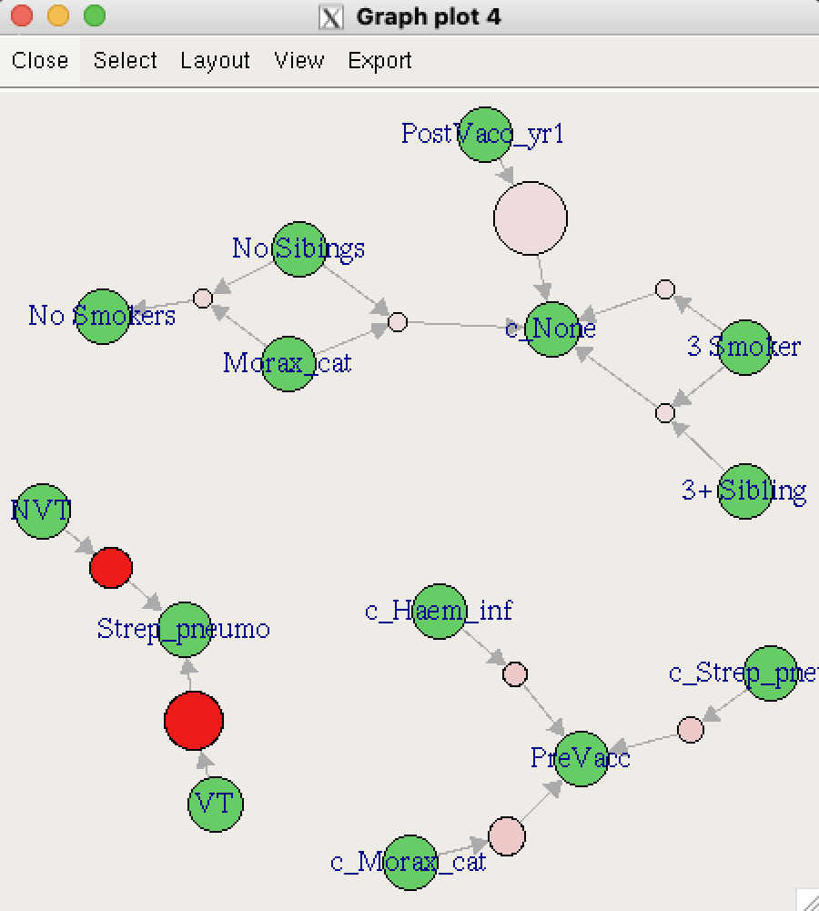

::: callout-important
## Page still in progress!!
:::

## Introduction

Market Basket Analysis, aka affinity analysis aka association rules mining is an unsupervised machine learning technique which applies an algorithm (apriori algorithm) to identify association rules in datasets.

We'll be applying this algorithm to identify associations in a dataset containing information about cases of perforative acute otitis media in children.

Overview:

-   *Application of market–basket analysis on healthcare by Rao et al. 2020* ([view paper](CPapers/Rao%20et%20al_2020_Overview%20Market–Basket%20Analysis%20on%20Healthcare.pdf))

Examples of different applications:

-   *Applying Market Basket Analysis to Determine Complex Coassociations Among Food Allergens in Children With Food Protein-Induced Enterocolitis Syndrome (FPIES) by Banerjee et al. 2024* ([view paper](CPapers/Banerjee%20et%20al_2024_Coassociations%20Among%20Food%20Allergens%20in%20Children%20With%20Food%20Protein-Induced%20Enterocolitis%20Syndrome%20(FPIES).pdf))
-   *Correlates of Nonrandom Patterns of Serotype Switching in Pneumococcus by Joshi et al. 2019* ([view paper](Papers/Joshi%20et%20al_2019_Nonrandom%20Patterns%20of%20Serotype%20Switching%20in%20Pneumococcus.pdf))

## Set Up the Environment

### Installing Tcl/Tk Libraries

The `tcltk2` package may require [Tcl/Tk](https://www.tcl-lang.org/) to be installed separately, depending on your system. Tcl (Tool Command Language) is an open-source programming language suitable for numerous development projects, while Tk is the standard graphical user interface (GUI) toolkit for many languages, including Tcl. Together, Tcl/Tk enables the creation of GUIs and interactive visualizations in R.

:::: panel-tabset
## Mac

Download [XQuartz](https://www.xquartz.org/), which provides a version of the X.Org X Window System that runs on macOS with supporting libraries and applications. As of this writing, the current version available is 2.8.5 for macOS 10.9 or later.

## Linux

For Debian-based systems (like Ubuntu)

``` {.bash filename="Command-Line Application"}
sudo apt-get install tcl tk
```

For RPM-based systems (like CentOS)

``` {.bash filename="Command-Line Application"}
sudo yum install tcl tk
```

## PC

::: callout-note
This page was developed on a Mac, and so the directions for a PC were not able to be tested.
:::

The base R distribution on Windows should include Tcl/Tk. If the `tcltk2` package fails to load, try reinstalling R and ensure you select the option to install Tcl/Tk components.
::::

With Tcl/Tk installed, we can now proceed with the standard process of installing the necessary packages. If you have not done so already, you will need to initialize the project's `renv` lockfile to ensure that the same package versions are installed in the project's local package library.

```{r}
#| message: FALSE
#| warning: FALSE

# NOTE: you might need to specify the source for the arules package:
# install.packages("arules", repos='http://cran.rstudio.com/')

suppressPackageStartupMessages({
  library("tidyverse")     # Collection of R packages for data science
  library("plyr")          # For data manipulation
  library("knitr")         # For dynamic report generation
  library("ggplot2")       # For creating static visualizations
  library("lubridate")     # For date and time manipulation
  library("htmlwidgets")   # For creating web-compatible HTML widgets
  library("arules")        # For mining association rules and frequent itemsets
  library("arulesViz")     # For visualizing association rules
  library("tcltk2")        # Provides enhanced functionality for Tcl/Tk GUI
  library("visNetwork")    # For creating interactive network plots in Quarto
  library("grid")
  library("gridExtra")
  library("RColorBrewer")  # For color palettes
  library("plotly")        # For creating interactive web-based graphs
  library("cowplot")       # For arranging multiple plots
  library("httr")          # For downloading files from URLs
})

# Function to select "Not In"
'%!in%' <- function(x,y)!('%in%'(x,y))
```

And our dataset

```{r}
#| message: FALSE
#| warning: FALSE

# Read in the cleaned data directly from the instructor's GitHub.
url <- "https://raw.githubusercontent.com/ysph-dsde/bdsy-phm/refs/heads/main/Data/pAOM.csv"
pAOM <- read_csv(url)
```


```{r}
# Summarize aspects and dimentions of our dataset.
glimpse(pAOM)
```

### Data Dictionary

We have 2137 rows representing 2137 cases of pAOM. Each row contains information about PtID- study ID of patient SmokeNum- number of smokers in household PtDayCare- did patient attend daycare SibNum- number of siblings in household NumSibDaycare- number of siblings in daycare Pre_Post_PCV13- did the case occur before or after the child could have received PCV13? (PreVacc, PostVacc_yr1-5) PCV13_Serotype_AOM- of pneumococcal pAOM cases, were they from PCV13 serotypes? (VT,NVTs) OtoPathogen- Strep_pneumo,Strep_pyogenes,Haem_inf, Morax_cat, Staph_aur, OthBact, PresViral Carriage1- otopathogens (c_Strep_pneumo,c_Strep_pyogenes,c_Haem_inf, c_Morax_cat, c_Staph_aur, c_None)found in NP carriage Carriage2- additional otopathogens found in NP carriage Carriage3- additional otopathogens found in NP carriage

Before using our rule mining algorithm, we need to transform data from the data frame format into transactions

```{r}
# Create a temporary file
temp_file <- tempfile()

# Download the data from GitHub and save it to the temporary file
GET(url, write_disk(temp_file, overwrite = TRUE))

# Read the transactions from the downloaded file
tr <- read.transactions(temp_file, format = 'basket', sep = ',')
```

```{r}
print('Description of the transactions')
summary(tr)
```

Let's see what items occur most frequently:

```{r}
itemFrequencyPlot(tr, topN = 25, type = "absolute", col = brewer.pal(8, "Pastel2"), main = "pAOM rules")
```

a relative frequency plot

```{r}
itemFrequencyPlot(tr,topN = 20, type = "relative", col = brewer.pal(8, "Pastel2"), main = "Relative frequency, pAOM")
```

## Create some rules

We use the Apriori algorithm from the arules package to look for itemsets and find support for rules

We pass supp=0.0001 and conf=0.8 to return all the rules have a support of at least 0.1% and confidence of at least 80%.

We sort the rules by decreasing confidence.

Here are the rules matching these criteria:

```{r}
rules <- apriori(tr, parameter = list(supp = 0.001, conf = 0.8))
rules <- sort(rules, by = "confidence", decreasing = TRUE)
summary(rules)
```

We have 4093 rules, most are 4 or 5 items long. Let's inspect the top 10 rules according to these parameters (supp 0.001, conf =0.8).

```{r}
inspect(rules[1:10])
```

And plot these top 10 rules, or 20, or 50.

```{r}
topRules <- rules[1:10]
plot(rules)
```

now with more colors

```{r}
plot(rules, method = "two-key plot")
```


## Network Graphs

```{r}
plot(topRules, method="graph")
```

Now let's explore some interactive map options: Tcl/Tk using `engine = "interactive"`, JavaScript using `engine = "visNetwork"`, and HTML using `engine = "htmlwidget"`. Note that the Tcl/Tk output displays in a separate window outside of the IDE and cannot be directly embedded in this document. Therefore, only a screenshot is shown.

```{r}
#| label: "Tcl/Tk Plot #1"
#| eval: false

plot(topRules, method = "graph", engine = "interactive")
```

{style="float: none; display: block; margin-left: auto; margin-right: auto; width: 50%;"}

```{r}
#| message: FALSE
#| warning: FALSE
#| output: FALSE

# Generate plots using different interactive engines.
visNetwork_plot <- plot(topRules, method = "graph", engine = "visNetwork")
htmlwidget_plot <- plot(topRules, method = "graph", engine = "htmlwidget")
```

```{r}
#| echo: false

# Save the plots as HTML files for visualizing side-by-side using the HTMl code
# that is below. This step is not necessary to generate the plot without
# page formatting.

visNetwork_file <- tempfile(fileext = ".html")
htmlwidget_file <- tempfile(fileext = ".html")

saveWidget(visNetwork_plot, visNetwork_file, selfcontained = TRUE)
saveWidget(htmlwidget_plot, htmlwidget_file, selfcontained = TRUE)
```

```{=html}
<div style="display: flex; justify-content: center; width: 100%;">
  <!-- Interactive visNetwork Plot -->
  <div style="flex: 1; margin-right: 10px; text-align: center; position: relative;">
    <h3>Interactive visNetwork Plot</h3>
    <iframe id="visNetwork_plot_frame" src="visNetwork_plot.html" width="100%" height="500px" style="border: 1px solid #ccc;"></iframe>
    <div style="position: absolute; bottom: 10px; right: 10px;">
      <button onclick="zoomIn('visNetwork_plot_frame')">Zoom In</button>
      <button onclick="zoomOut('visNetwork_plot_frame')">Zoom Out</button>
      <button onclick="resetVisNetworkPlot('visNetwork_plot_frame', 'visNetwork_plot.html')">Reset</button>
    </div>
  </div>

  <!-- Another htmlwidget Plot -->
  <div style="flex: 1; margin-left: 10px; text-align: center; position: relative;">
    <h3>Interactive htmlwidget Plot</h3>
    <iframe id="htmlwidget_plot_frame" src="htmlwidget_plot.html" width="100%" height="500px" style="border: 1px solid #ccc;"></iframe>
    <div style="position: absolute; bottom: 10px; right: 10px;">
      <button onclick="zoomIn('htmlwidget_plot_frame')">Zoom In</button>
      <button onclick="zoomOut('htmlwidget_plot_frame')">Zoom Out</button>
      <button onclick="resetHtmlwidgetPlot('htmlwidget_plot_frame', 'htmlwidget_plot.html')">Reset</button>
    </div>
  </div>
</div>

<script>
  let zoomLevel = 1; // Initial zoom level
  const zoomFactor = 1.1;

  function centerGraphContainer(iframeDocument, graphContainer) {
    const iframeWindow = iframeDocument.defaultView;
    const scaledWidth = graphContainer.scrollWidth * zoomLevel;
    const scaledHeight = graphContainer.scrollHeight * zoomLevel;
    const widthScroll = (scaledWidth - iframeWindow.innerWidth) / 2;
    const heightScroll = (scaledHeight - iframeWindow.innerHeight) / 2;
    iframeWindow.scrollTo(widthScroll, heightScroll);
  }

  function applyZoomAndCenter(frameId) {
    const frame = document.getElementById(frameId);
    if (frame && frame.contentWindow) {
      const iframeDocument = frame.contentDocument || frame.contentWindow.document;
      const graphContainer = iframeDocument.querySelector('.vis-network');
      if (graphContainer) {
        graphContainer.style.transform = `scale(${zoomLevel})`;
        graphContainer.style.transformOrigin = '0 0';

        centerGraphContainer(iframeDocument, graphContainer);
      }
    }
  }

  function zoomIn(frameId) {
    zoomLevel *= zoomFactor;
    applyZoomAndCenter(frameId);
  }

  function zoomOut(frameId) {
    zoomLevel /= zoomFactor;
    applyZoomAndCenter(frameId);
  }

  function resetView() {
    zoomLevel = 1;
    initialView();
  }

  function initialView() {
    const frame = document.getElementById('htmlwidget_plot_frame2');
    const iframeDocument = frame.contentDocument || frame.contentWindow.document;
    const iframeWindow = frame.contentWindow;

    iframeDocument.body.style.overflow = 'hidden';

    const graphContainer = iframeDocument.querySelector('.vis-network');
    if (graphContainer) {
      const width = graphContainer.scrollWidth - iframeWindow.innerWidth;
      const height = graphContainer.scrollHeight - iframeWindow.innerHeight;
      iframeWindow.scrollTo(width / 2, height / 2);
    }
  }

  document.addEventListener('DOMContentLoaded', () => {
    initialView();
  });

  window.addEventListener('resize', () => {
    initialView();
  });

  function resetVisNetworkPlot() {
    resetViewHelper('visNetwork_plot_frame', 'visNetwork_plot.html');
  }

  function resetHtmlwidgetPlot() {
    resetViewHelper('htmlwidget_plot_frame', 'htmlwidget_plot.html');
  }

  function resetViewHelper(frameId, frameSrc) {
    zoomLevel = 1; // Reset zoom level to initial state
    const frame = document.getElementById(frameId);
    frame.src = frameSrc + "?reload=" + new Date().getTime();
    frame.onload = initialView;
  }
</script>
```

```{r}
plot(topRules, method = "grouped")
```

now a matrix plot

```{r}
plot(topRules, method = "matrix", engine = "3d", measure = "lift")
```

moving back a bit, let's check a different set of rules:

```{r}
rules_b <- apriori(tr, parameter = list(supp = 0.01, conf = 1.0))
rules_b <- sort(rules_b, by = "confidence", decreasing = TRUE)
summary(rules_b)
```

these more stringent criteria mean that we're down to 115 rules to sort through.

```{r}
inspect(rules_b[1:10])
```

try to look for only for rules associated with Strep_pneumo

```{r}
pneumo.rules <- sort(subset(rules_b, subset = rhs %in% "Strep_pneumo"))

inspect(pneumo.rules[1:10])
```

now let's plot the pneumo rules:

```{r}
plot(pneumo.rules, measure = c("support", "confidence"), shading = "lift")
```


## Troubleshooting

```{r}
#| message: FALSE
#| warning: FALSE
#| output: FALSE

pneumo_rules_plot <- plot(pneumo.rules[1:10], method = "graph", engine = "htmlwidget")
```

```{r}
#| echo: false
#| message: FALSE
#| warning: FALSE

# Save the plots as HTML and png files for visualizing side-by-side using the
# HTMl code that is below. This step is not necessary to generate the plot
# without page formatting.

pneumo_rules_file <- tempfile(fileext = ".html")
saveWidget(pneumo_rules_plot, pneumo_rules_file, selfcontained = TRUE)
```


```{=html}
<div style="display: flex; justify-content: center; width: 100%;">
  <!-- Interactive htmlwidget Plot -->
  <div style="flex: 1; margin-right: 10px; text-align: center; position: relative;">
    <iframe id="htmlwidget_plot_frame2" src="pneumo_rules_plot.html" width="100%" height="450px" style="border: 1px solid #ccc;"></iframe>
    <div style="position: absolute; top: 10px; right: 10px;">
      <button onclick="zoomIn('htmlwidget_plot_frame2')">Zoom In</button>
      <button onclick="zoomOut('htmlwidget_plot_frame2')">Zoom Out</button>
      <button onclick="resetHtmlwidgetPlot2('htmlwidget_plot_frame2', 'pneumo_rules_plot.html')">Reset</button>
    </div>
  </div>
</div>

<script>
  let zoomLevel = 1;
  const zoomFactor = 1.1;

  function centerIframeContent(frame) {
    frame.onload = function() {
      const iframeDocument = frame.contentDocument || frame.contentWindow.document;
      const iframeWindow = frame.contentWindow;

      iframeDocument.body.style.overflow = 'hidden';

      const graphContainer = iframeDocument.querySelector('.vis-network');
      if (graphContainer) {
        graphContainer.style.transform = `scale(${zoomLevel})`;
        graphContainer.style.transformOrigin = '0 0';

        const width = graphContainer.scrollWidth - iframeWindow.innerWidth;
        const height = graphContainer.scrollHeight - iframeWindow.innerHeight;
        iframeWindow.scrollTo(width / 2, height / 2);
      }
    };
  }

  function zoomIn(frameId) {
    zoomLevel *= zoomFactor;
    setZoom(frameId);
  }

  function zoomOut(frameId) {
    zoomLevel /= zoomFactor;
    setZoom(frameId);
  }

  function setZoom(frameId) {
    const frame = document.getElementById(frameId);
    if (frame && frame.contentWindow) {
      const iframeDocument = frame.contentDocument || frame.contentWindow.document;
      const graphContainer = iframeDocument.querySelector('.vis-network');
      if (graphContainer) {
        graphContainer.style.transform = `scale(${zoomLevel})`;
        graphContainer.style.transformOrigin = '0 0';
      }
    }
  }

  function initialView() {
    const frame = document.getElementById('htmlwidget_plot_frame2');
    const iframeDocument = frame.contentDocument || frame.contentWindow.document;
    const iframeWindow = frame.contentWindow;

    iframeDocument.body.style.overflow = 'hidden';

    const graphContainer = iframeDocument.querySelector('.vis-network');
    if (graphContainer) {
      const width = graphContainer.scrollWidth - iframeWindow.innerWidth;
      const height = graphContainer.scrollHeight - iframeWindow.innerHeight;
      iframeWindow.scrollTo(width / 2, height / 2);
    }
  }

  document.addEventListener('DOMContentLoaded', () => {
    initialView();
  });

  window.addEventListener('resize', () => {
    initialView();
  });

  function resetHtmlwidgetPlot2(frameId, frameSrc) {
    zoomLevel = 1; // Reset zoom level
    const frame = document.getElementById(frameId);
    frame.src = frameSrc + "?reload=" + new Date().getTime();
    frame.onload = function() {
      centerIframeContent(frame);
    };
  }
</script>
```


```{r}
plot(pneumo.rules[1:10], method = "paracoord", control = list(reorder = TRUE))
```


reference: [R and Data Mining](http://www.rdatamining.com/examples/association-rules) there are other cool market basket analysis visualizations here:
